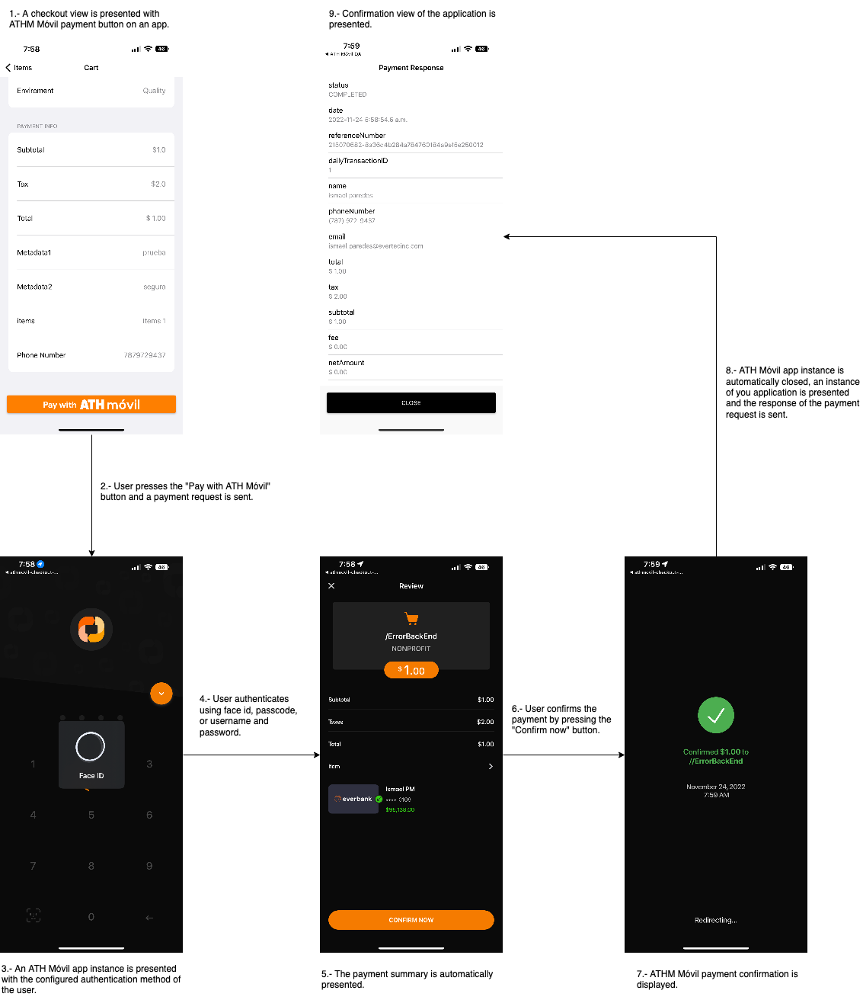

# ATH Móvil Payment Button - iOS SDK


## Introduction
ATH Móvil's Payment Button SDK provides a simple, secure and fast checkout experience to customers paying on your iOS application. After integrating our Payment Button on your app you will be able to receive real time payments from more than 1.5 million ATH Móvil users.


Disclaimer: We currently **do not** have a **Testing environment**. You need to have an active ATH Business account and a active ATH Móvil account.

## Prerequisites
Before using the ATH Móvil’s payment you need to have:

### ATH Business

1\. An active ATH Business account.

2\. A card registered in your ATH Business profile. 

3\. The public and private key assigned to your business.

For instructions on how to open a ATH Business account please refer to: [ATHB flyer eng letter 1.pdf](https://github.com/user-attachments/files/16267504/ATHB.flyer.eng.letter.1.pdf)

For more information related to ATH Business and how it works please refer to:[ATH BUSINESS_Apr2024.pptx](https://github.com/user-attachments/files/16267585/ATH.BUSINESS_Apr2024.pptx)

### ATH Móvil

To complete the payment for testing purposes you need to have:

1\. An active ATH Móvil account.

2\. A card registered in your ATH Móvil profile. It can not be the same card that is registered in ATH Business.

For more information related to ATH Móvil and how it works please refer to:[ATH Móvil_Apr2024.pptx](https://github.com/user-attachments/files/16267592/ATH.Movil_Apr2024.pptx)


## Support
If you need help signing up, adding a card or have any other question please refer to https://ath.business.com/preguntas. For technical support please complete the following form:  https://ath.business/botondepago.


## Installation
Before we get started, let's configure your project:

* Install CocoaPods (<a href="https://cocoapods.org">click here</a> for detailed instructions). After installing it use `pod init` to initiate Podfile.

* Add the `athmovil-checkout` pod requirement to your Podfile.
```swift
target 'MyProject' do
use_frameworks!
pod 'athmovil-checkout'
end
```
* Execute `pod install` to complete the installation of the SDK pod.
* Open the Cocoapods workspace and make sure your project still compiles.
* You can now start using the ATH Móvil Payment Button.

## Usage
To implement ATH Móvil’s Payment Button on your iOS application you will need to complete the step by step guide below. By following this guide you will be able to:
* Present the "Pay with ATH Móvil" button on the interface of your application.
* Send payment requests to ATH Móvil.
* Manage the response of payment requests sent by ATH Móvil.

### Present the "Pay with ATH Móvil" button on the interface of your application.
ATH Móvil's Payment Button defines a class named `ATHMButton` for user interfaces. You can create instances of `ATHMButton` in three different ways:
* Using the "Pay with ATH Móvil" button in Storyboard or Xib.
* Converting a UIKit `UIButton` to the "Pay with ATH Móvil" button style.
* Adding the "Pay with ATH Móvil" button by code.

The text of the "Pay with ATH Móvil" button will be automatically displayed on the configured language of devices.  

| Languages  | Example |
| ------------- |-------------|
| English |  |
| Spanish |  |

#### Using the "Pay with ATH Móvil" button in Storyboard or Xib
  1. Open the interface builder of your view and add a `UIButton` to it.
  2. Change the following properties of the new `UIButton`:
    
  3. Create the `@IBOutlet` in your view controller or add the `@IBaction` event to your view controller. `ATHMButton` is set to classic style by default but you can change the theme using the property `theme`.

#### Converting a UIKit `UIButton` to the "Pay with ATH Móvil" button style
If you have an instance of a UIKit `UIButton`, you can convert it to a "Pay with ATH Móvil" using the following methods:

| Theme  | Example |
| ------------- |-------------|
| .toggleATHMClassic() |  |
| .toggleATHMLight() |  |
| .toggleATHMNight() |  |

Your button will be an instance of `UIButton`, but it will have ATH Móvil's Payment Button style.

#### Adding the "Pay with ATH Móvil" button by code
You can create an instance of the "Pay with ATH Móvil" button using the following sample code:
```swift
let athMovilButton = ATHMButton(frame: CGRect(x: 0, y: 0, width: 320, height: 50))
view.addSubview(athMovilButton)
athMovilButton.addTarget(self, action:#selector(payWithATHMovil(_:)), for: UIControl.Event.touchUpInside)
```
* `ATHMButton` inherits from `UIButton`. This means you can use UIKit functionalities such as `frame`, `addsubview` and `addtarget` methods.
* You can change the theme of the `ATHMButton` instance by modifying the `theme` property. The theme can me modified safely in a thread muiltiple times.

| Theme  | Example |
| ------------- |-------------|
| athMovilButton.theme = ATHMThemeClassic() |  |
| athMovilButton.theme = ATHMThemeLight() |  |
| .athMovilButton.theme = ATHMThemeNight() |  |


### Send payment requests to ATH Móvil
The Payment Button SDK provides some simple classes that allow you to send payment requests to ATH Móvil as in the following sample code:

```swift
func payWithATHMovil() {

    let businessAccount = ATHMBusinessAccount(token: "Public Token of your ATH Móvil business account")
    let urlScheme = ATHMURLScheme(urlScheme: "URL Scheme of your application")
    let payment = ATHMPayment(total: 20.00)

    /// The object below will tell you the status of the payment after the end user has completed the payment process.
    /// The code inside onCompleted, onExpired, onCancelled, onFailed or onException is on the main thread.

    let hander = ATHMPaymentHandler(onCompleted: { [weak self] (payment: ATHMPaymentResponse) in
        /// Handle the response when the payment is completed here.

    }, onExpired: { [weak self] (payment: ATHMPaymentResponse) in
        /// Handle the response when the payment is expired here.

    }, onCancelled: { [weak self] (payment: ATHMPaymentResponse) in
        /// Handle the response when the payment is cancelled here.

    }, onFailed: { [weak self] (payment: ATHMPaymentResponse) in
        /// Handle the response when the payment is failed here.
        
    }) { [weak self] (error: ATHMPaymentError) in
        /// Handle any exception regarding a request or response here. See error section for more details.
    }

    let request = ATHMPaymentSecureRequest(account: businessAccount, scheme: urlScheme, payment: payment)
    request.pay(handler: hander)

    /// At this point your app will open ATH Móvil and the payment process will start.
    /// If ATH Móvil is not installed on the end user's device the App Store will be automatically opened on ATH Móvil's listing.
}
```
* The payment process is decoupled from the user interface, this means you can use those classes to make payment requests no matter if your are using a `UIButton` or the `ATHMButton`.
* The following optional properties can be used to add additional information to the payment:
  ```swift
      payment.phoneNumber = /// Set to empty string by default
      payment.subtotal = 1.00  /// Set to 0 by default
      payment.tax = 2.00       /// Set to 0 by default
      payment.metadata1 = "Attach data to the payment object" /// Empty String by default
      payment.metadata2 = "Attach data to the payment object" /// Empty String by default
      payment.items = [ATHMPaymentItem(name: "Test Item", price: 1, quantity: 1 )] /// Empty array by default
      request.timeout = 120 /// Amount of time that the user has to complete the payment process. This time is for ATH Movil Personal application
  ```
  | Variable  | Data Type | Required | Description |
  | ------------- |:-------------:|:-----:| ------------- |
  | `total` | NSNumber | Yes | Total amount to be paid by the end user. |
  | `phoneNumber` | String | No | Phone number to identify the customer. |
  | `subtotal` | NSNumber | No | Optional  variable to display the payment subtotal (if applicable) |
  | `tax` | NSNumber | No | Optional variable to display the payment tax (if applicable). |
  | `metadata1` | String | No | Optional variable to attach data to the payment object. Max length 40 characters. |
  | `metadata2` | String | No | Optional variable to attach data to the payment object. Max length 40 characters |
  | `items` | Array | No | Optional variable to display the items that the user is purchasing on ATH Móvil's payment summary screen. |
  | `token` | ATHMBusinessAccount | Yes | Public token of ATH Móvil Business account. For testing set public token as "dummy" |
  | `urlScheme` | ATHMURLScheme | Yes | URL scheme defined in your project. For instructions on how to define a custom URL scheme for your application <a href="https://developer.apple.com/documentation/uikit/core_app/allowing_apps_and_websites_to_link_to_your_content/defining_a_custom_url_scheme_for_your_app">click here</a>. |
  | `timeout` | Double | Yes | This optional timeout expires the payment process if the payment hasn't been completed by the user after the provided amount of time (in seconds). Countdown starts when ATH Movil Application shows the payment review. Default value is set to 600 seconds (10 mins). |
  | `handler` | ATHMPaymentHandler | Yes | Object that handles the response of the payment. The code inside onCompleted, onExpired, onCancelled, onFailed or onException is on main thread 👁❗️|

  **Items Array**

  | Variable  | Data Type | Required | Description |
  | ------------- |:-------------:|:-----:| ------------- |
  | `name` | String | Yes | Name of item. |
  | `desc` | String | No | Brief description of the item. |
  | `price` | NSNumber | Yes | Price of individual item. |
  | `quantity` | Int | Yes | Quantity of individual item. |
  | `metadata` | String | No | Optional variable to attach data to the item object. |


### Manage the response of payment requests sent by ATH Móvil
After users press the Payment button on your application and complete the payment on ATH Móvil, ATH Móvil is going to automatically open your application to send you the payment response. Your application needs to be properly configured to receive these responses. To prepare your application add the following lines to your AppDelegate or the main Scene:

```swift
func application(_ app: UIApplication, open url: URL, options: [UIApplication.OpenURLOptionsKey : Any] = [:]) -> Bool {
    ATHMPaymentSession.shared.url = url
    return true
}
```

* You will now receive the payment response on the object handler that you previously defined in the request.
* It is not necessary to keep a reference of the handler, the SDK will automatically do it. After the SDK processes the URL it will call the correct request through `ATHMHandler` and use the callback `onCompleted`, `onExpired`, `onCancelled`, `onFailed` or `onException` depending on the outcome of the payment.
* If your application has other deep links or other third party apps that open your application using the method `application(app:open:options:)`, the ATH Móvil SDK will automatically discard the URL so you don't need to implement additional validations for `ATHMPaymentSession.shared.url = url`.

`ATHMPaymentHandler` will now receive an object with the type `ATHMPaymentResponse`. Depending on the outcome of the transaction the closures `onCompleted`, `onExpired`, `onFailed` or `onCancelled` will be automatically called. You will receive an object with the payment information as follows:

```swift
/// Payment data initially configured on the request.
response.payment.total
response.payment.subtotal
response.payment.tax
response.payment.fee
response.payment.netAmount
response.payment.metadata1
response.payment.metadata2

/// Items data initially configured on the request.
let paymentItem = response.payment.items.first
paymentItem?.name
paymentItem?.price
paymentItem?.quantity
paymentItem?.desc
paymentItem?.metadata

/// Transaction information.
response.status.dailyTransactionID /// Consecutive of the transaction
response.status.referenceNumber /// Unique idenfier of the transaction
response.status.date /// Date of the transaction

/// ATH Móvil user information.
response.customer.name /// Customer name
response.customer.phoneNumber /// Customer telephone number in format (xxx) xxx-xxxx
response.customer.email /// Customer email

```
| Variable  | Data Type | Description |
| ------------- |:-------------:|------------- |
| `dailyTransactionID` | Int | Daily ID of the transaction. If the transaction was cancelled o expired value will be 0. |
| `referenceNumber` | String | Unique transaction identifier. If the transaction was cancelled or expired the value will be an empty string. |
| `date` | Date | Date of transaction. |
| `customer.name` | String | Name registered on ATH Móvil of user that paid for the transaction. This value might be empty if the transaction wasn't completed by the end user. |
| `customer.phoneNumber` | String | Phone number registered on ATH Móvil of user that paid for the transaction. This value might be empty if the transaction wasn't completed by the end user. |
| `customer.email` | String | Email address registered on ATH Móvil of user that paid for the transaction. This value might be empty if the transaction wasn't completed by the end user. |

* *Note: `response.payment` and `payment.items` are the same objects that were received on the request. Values and data types will be identical.*


If unexpected data is sent on the request of the payment the SDK will call the closure `onException` and you will receive an object with the type `ATHMPaymentError`. Your application must be able to handle these exceptions. You can view the cause of the exception using the following sample code:

```swift
...
}) { [weak self] (error: ATHMPaymentError) in

            error.failureReason ///Description of the error.
            error.errorDescription ///"Error in request" or "Error in response".
            error.isRequestError ///True if the error is in the request.
            ///Here you will receive any exception related to a request or response.
}
```

* In the request, make sure that you comply with these requirements for `ATHMPayment`, `ATHMBusinessAccount` and the `ATHMURLScheme` objects, otherwise you will receive an exception on the callback.

  | Variable  | Expected Value |
  | ------------- |:-------------:|
  | `total` | Positive value |
  | `subtotal` | Positive value or zero |
  | `tax` | Positive value or zero |
  | `phoneNumber` | A string with characters or digits |
  | `metadata1` | A string with characters, digits or spaces  |
  | `metadata2` | A string with characters, digits or spaces |
  | `token` | A string with characters |
  | `urlScheme` | A string with characters. **Do not use the urlscheme in the example❗️** |
  | `timeout` | Integer between 60 and 600 |

* If you provide items in the request make sure you comply with these requirements for the `ATHMPaymentItem` object:

  | Variable  | Expected Value |
  | ------------- |:-------------:|
  | `name` | A string with characters |
  | `desc` | A string with characters, digits or spaces |
  | `price` | Positive value greater than zero |
  | `quantity` | Positive value greater than zero |
  | `metadata` | A string with characters, digits or spaces |


## Testing
To test your Payment Button integration you can make payments in production using the Private and Public tokens of your ATH Móvil Business account or you can use the public token "dummy" to make simulated payments. When you use the token "dummy":
* The ATH Movil production application will simulate a payment.
* No end user credentials need to be provided to interact with the simulated payment.
* Completed, cancelled and expired payments can be tested.

```swift
func payWithATHMovil() {

    let businessDummy = ATHMBusinessAccount(token: "dummy")
    ...
```

## Hybrid Apps
If your application is built with Flutter or Ionic you might need to send a dictionary to our SDK.  The classes `ATHMBusinessAccount`, `ATHMURLScheme` and `ATHMPayment` all have constructors for dictionaries. You should use the `ATHMPaymentHandlerDictionary` and the method `pay` to receive the `ATHMPaymentHandlerDictionary` instance. For example:


```swift
...
let requestDic = NSDictionary(dictionary: ["scheme": "athm-checkout",
                                            "publicToken": "dummy",
                                            "total": 20.00,
                                            "subtotal": 1.00,
                                            "tax": "2.00",
                                            "phoneNumber": "7879729437",
                                            "metadata1": "This is metadata1",
                                            "metadata2": "This is metadata2",
                                            "items":[
                                                ["name": "ItemTest",
                                                "price": 2.0,
                                                "quantity": 1,
                                                "desc": "Description",
                                                "metadata": "Metadata"]
                                                ]
                                            ])

let businessAccount = ATHMBusinessAccount(dictionary: requestDic)
let urlScheme = ATHMURLScheme(dictionary: requestDic)
let payment = ATHMPayment(dictionary: requestDic)

let handler = ATHMPaymentHandlerDictionary(onCompleted: { [weak self] (response: NSDictionary) in
    /**
    response["total"]
    response["items"]
    response["name"]
    response["email"]
    ...
    */
}, onExpired: { [weak self] (response: NSDictionary) in

}, onFailed: { [weak self] (response: NSDictionary) in

}, onCancelled: { [weak self] (response: NSDictionary) in

}) { [weak self] (error: ATHMPaymentError) in
}

let request = ATHMPaymentSecureRequest(account: businessAccount, scheme: urlScheme, payment: payment)
request.pay(dictionaryHandler: handler)
```
* This dictionary has all the required properties. Some of these properties are optional, as indicated in the "Manage the response of payment requests sent by ATH Móvil" section above.
* The response of payments are also a dictionary, which means you can view the response data using the keys mentioned in the "Manage the response of payment requests sent by ATH Móvil" section above.
* The public token "dummy" can also be used with the dictionary.
* *Note: `ATHMPaymentSession` is required for the response of the payment.*

## User experience


## Legal
The use of this API and any related documentation is governed by and must be used in accordance with the Terms and Conditions of Use of ATH Móvi Business ®, which may be found at: https://athmovilbusiness.com/terminos.
